# Manual de Usuario - BiblioSystem

## 1. Introducción

BiblioSystem es un sistema de gestión bibliotecaria desarrollado para la Biblioteca Central Universitaria. Permite administrar libros, usuarios (estudiantes y operadores), controlar préstamos y devoluciones, y generar reportes en formato HTML.

Este manual explica paso a paso cómo utilizar cada funcionalidad del sistema según el rol del usuario.

---

## 2. Requisitos para Ejecutar el Sistema

1. Tener instalado Java JDK 8 o superior
2. Ejecutar el archivo `BiblioSystem.jar` o desde NetBeans presionando **Run → Run Project**
3. El sistema creará automáticamente los archivos necesarios:
   - `cuentas.txt` - Almacena usuarios
   - `prestamos.txt` - Almacena préstamos
   - `bitacora.txt` - Registro de operaciones

---

## 3. Pantalla de Inicio de Sesión

Al ejecutar el programa, aparece la siguiente pantalla:
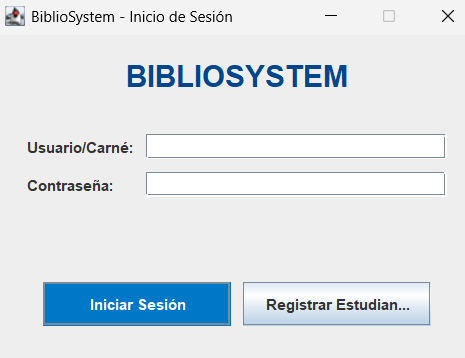

---

## 4. Registro de Estudiante

Si eres estudiante y no tienes cuenta, haz clic en **"Registrar Estudiante"**. Aparecerá un formulario:
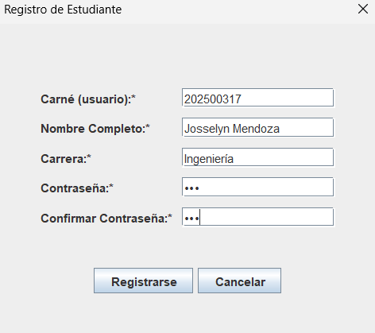

**Reglas:**
- El carné debe ser único y funcionará como nombre de usuario
- Todos los campos son obligatorios
- Las contraseñas deben coincidir

Después de registrarse, podrás iniciar sesión con tu carné y contraseña.

---

## 5. Roles de Usuario

El sistema tiene tres roles con diferentes permisos:

| Rol | Descripción |
|-----|-------------|
| **Administrador** | Gestiona operadores. Acceso a todos los módulos |
| **Operador** | Gestiona libros, estudiantes, préstamos y reportes |
| **Estudiante** | Solicita préstamos y consulta su historial |

---

## 6. Menú del Administrador

Al iniciar sesión como administrador (usuario: `admin`, contraseña: `admin`), se muestra:

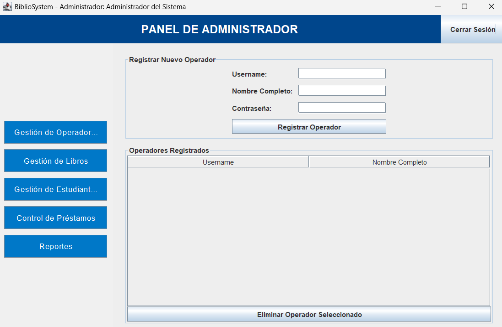

### 6.1 Gestión de Operadores

| Acción | Cómo hacerlo |
|--------|--------------|
| **Registrar Operador** | Llenar formulario (username, nombre, contraseña) y hacer clic en "Registrar Operador" |
| **Listar Operadores** | Se muestran automáticamente en la tabla |
| **Eliminar Operador** | Seleccionar operador en la tabla y hacer clic en "Eliminar Operador Seleccionado" |

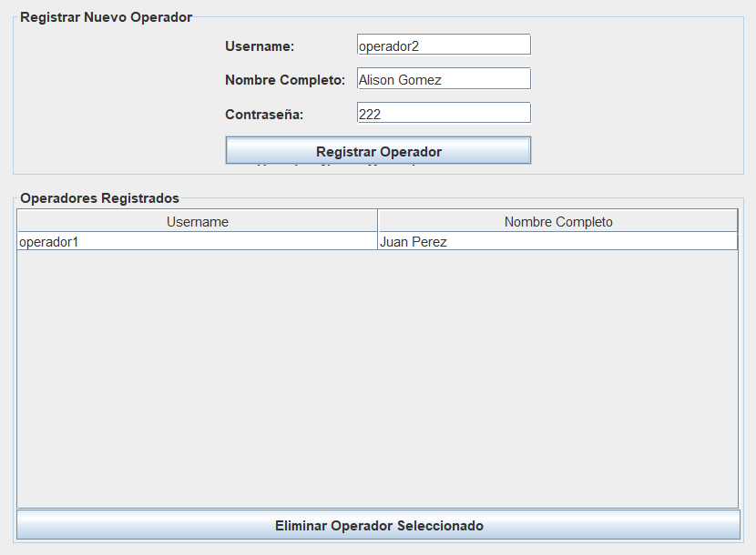
---

## 7. Menú del Operador

Al iniciar sesión como operador:

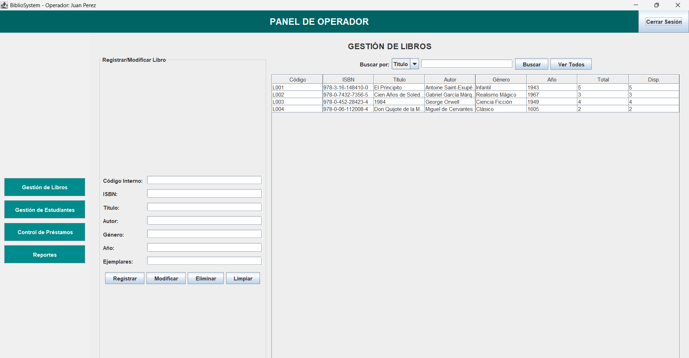

### 7.1 Gestión de Libros

| Acción | Descripción |
|--------|-------------|
| **Registrar Libro** | Llenar todos los campos y hacer clic en "Registrar" |
| **Modificar Libro** | Seleccionar libro en la tabla, modificar campos y hacer clic en "Modificar" |
| **Eliminar Libro** | Seleccionar libro y hacer clic en "Eliminar" (solo si no tiene préstamos activos) |
| **Buscar Libro** | Escribir en el campo de búsqueda y seleccionar por Título, Autor o ISBN |
| **Ver Todos** | Hacer clic en "Ver Todos" para mostrar todos los libros |

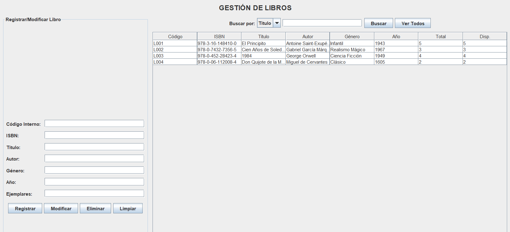

### 7.2 Gestión de Estudiantes

| Acción | Descripción |
|--------|-------------|
| **Buscar Estudiante** | Ingresar carné y hacer clic en "Buscar por Carné" |
| **Listar Todos** | Hacer clic en "Listar Todos" |
| **Eliminar Estudiante** | Seleccionar estudiante en la tabla y hacer clic en "Eliminar" (solo si no tiene préstamos) |

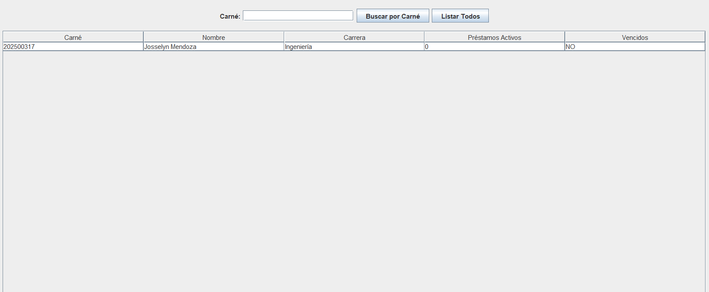

### 7.3 Control de Préstamos

**Registrar Préstamo:**
1. Ingresar carné del estudiante
2. Ingresar código o ISBN del libro
3. Hacer clic en "Registrar Préstamo"
4. El sistema valida:
   - Estudiante existe
   - No tenga préstamos vencidos
   - No tenga más de 3 préstamos activos
   - Libro tenga ejemplares disponibles

**Registrar Devolución:**
1. Ingresar código de préstamo o carné del estudiante
2. Hacer clic en "Registrar Devolución"

**Ver Préstamos Activos:**
- Se muestran automáticamente en la tabla de la derecha
- Los préstamos vencidos aparecen con color de fondo diferente

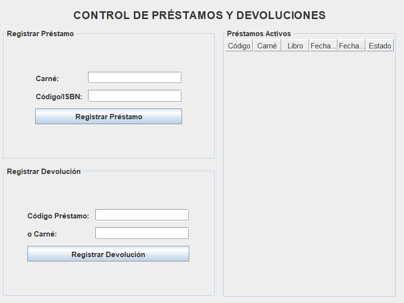

---

## 8. Menú del Estudiante

Al iniciar sesión como estudiante:
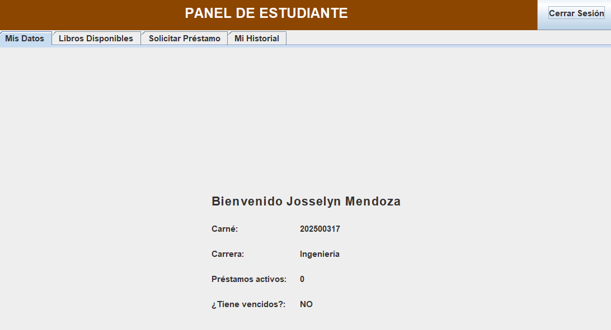

### 8.1 Pestañas del Estudiante

| Pestaña | Descripción |
|---------|-------------|
| **Mis Datos** | Muestra información personal: carné, carrera, préstamos activos, si tiene vencidos |
| **Libros Disponibles** | Lista todos los libros con ejemplares disponibles |
| **Solicitar Préstamo** | Formulario para pedir un libro (código o ISBN) |
| **Mi Historial** | Muestra todos sus préstamos (activos y devueltos) |

### 8.2 Solicitar Préstamo

1. Ir a la pestaña "Solicitar Préstamo"
2. Ingresar código interno o ISBN del libro
3. Hacer clic en "Solicitar Préstamo"
4. Si es válido, aparece mensaje de confirmación con fecha límite

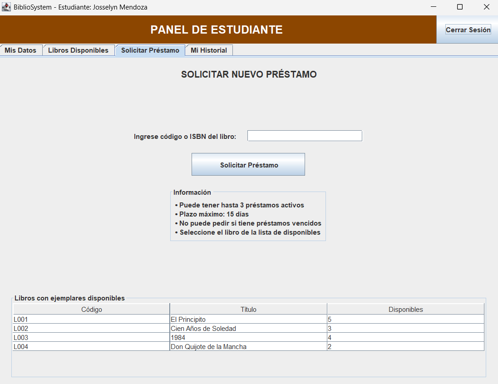

**Restricciones:**
- Máximo 3 préstamos activos
- No puede tener préstamos vencidos
- El libro debe tener ejemplares disponibles

---

## 9. Generación de Reportes

Todos los usuarios (excepto estudiantes) pueden generar reportes en formato HTML desde el menú "Reportes".

### Tipos de Reportes:

| Reporte | Contenido |
|---------|-----------|
| **Préstamos Vencidos** | Lista de préstamos activos con fecha límite vencida, muestra días de atraso |
| **Libros Disponibles** | Lista de libros con al menos un ejemplar disponible |
| **5 Libros Más Prestados** | Top 5 libros con más préstamos en la historia |
| **Estudiantes con Préstamos Activos** | Lista de estudiantes que tienen préstamos vigentes |

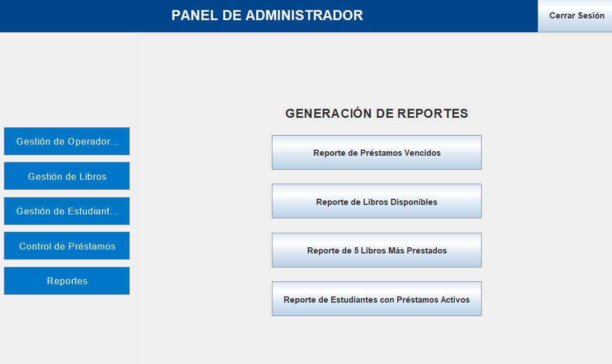

### Cómo Generar un Reporte:

1. Hacer clic en el botón del reporte deseado
2. El sistema muestra mensaje: "Reporte generado: nombre_archivo.html"
3. Los reportes se guardan en la carpeta del proyecto

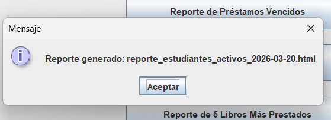

### Cómo Ver un Reporte:

1. Abrir la carpeta donde está instalado el programa
2. Buscar el archivo HTML (ej: `reporte_libros_disponibles_2026-03-20.html`)
3. Hacer doble clic para abrirlo en el navegador

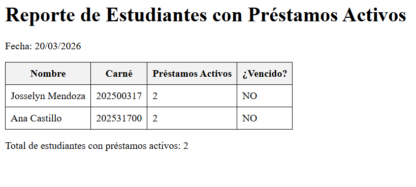

---

## 10. Bitácora de Operaciones

El sistema registra automáticamente todas las acciones importantes en el archivo `bitacora.txt`.

**Ejemplo de bitácora:**
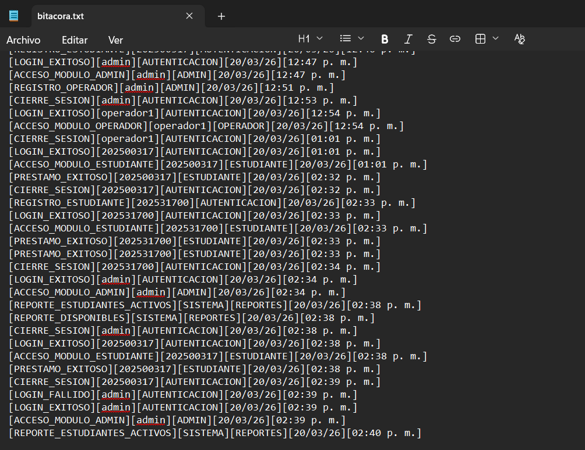

---

## 11. Mensajes de Error Comunes

| Mensaje | Causa | Solución |
|---------|-------|----------|
| "Usuario o contraseña incorrectos" | Credenciales inválidas | Verificar usuario y contraseña |
| "El estudiante ya tiene 3 préstamos activos" | Límite alcanzado | Devolver algún libro antes de pedir otro |
| "El estudiante tiene préstamos vencidos" | Préstamo no devuelto a tiempo | Devolver el libro vencido |
| "No hay ejemplares disponibles" | Todos los ejemplares están prestados | Esperar devolución |
| "No se puede eliminar: tiene préstamos activos" | Libro o estudiante con préstamos vigentes | Devolver préstamos primero |

---

## 12. Cerrar Sesión

Para cerrar la sesión actual, hacer clic en el botón **"Cerrar Sesión"** ubicado en la esquina superior derecha de cada pantalla.

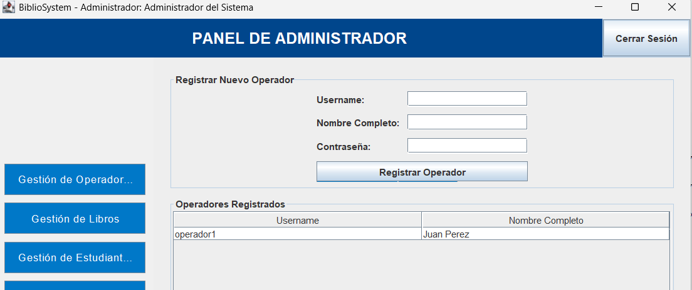

---

*Manual de Usuario - BiblioSystem v1.0 - Marzo 2026*